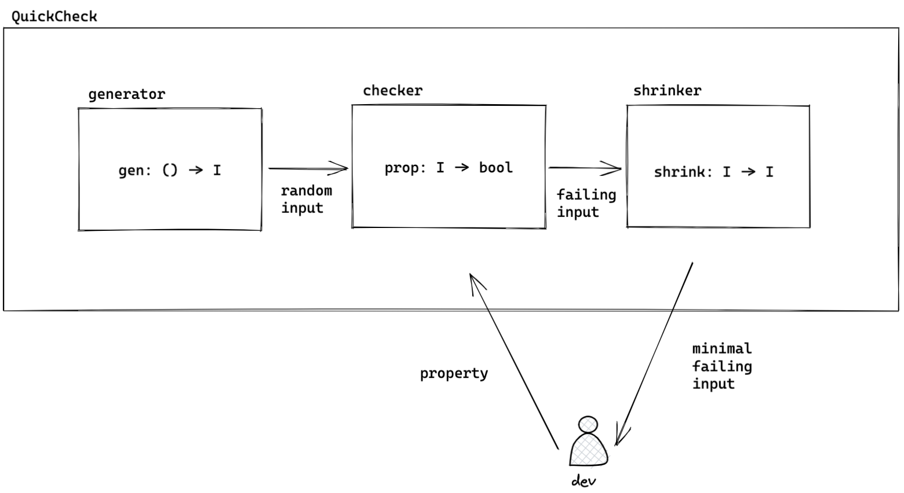

# Property-based testing 101

## How to run the tests
* [Install Rust](https://www.rust-lang.org/tools/install)
* Run `cargo test`

## Slides

### QuickCheck


### The wallet
```rust
struct Wallet {
    quantity: Quantity,
}

impl Wallet {
    
    ...

    pub fn execute(
        &mut self,
        operation: &Operation
    ) -> Result<Quantity, anyhow::Error> {
        ...
    }

}

pub struct Operation(Vec<Transaction>);

pub enum Transaction {
    Buy { quantity: u16 },
    Sell { quantity: u16 },
}
```

### TDD: the example-based test #1
```rust
#[test]
fn buy_some_stock() {
    let mut wallet = Wallet::new();
    let operation = Operation(vec![
        Transaction::Buy { quantity: 7 }
    ]);

    let result = wallet.execute(&operation);

    assert_eq!(result.unwrap(), 7);
}
```

### TDD: the example-based test #2
```rust
#[test]
fn buy_and_sell_some_stock() {
    let mut wallet = Wallet::new();
    let operation = Operation(vec![
        Transaction::Buy { quantity: 7 },
        Transaction::Sell { quantity: 2 },
    ]);

    let result = wallet.execute(&operation);


    assert_eq!(result.unwrap(), 5);
}

```

### TDD: the example-based test #3
```rust
#[test]
fn fail_when_selling_more_than_owned() {
    let mut wallet = Wallet::new();
    let operation = Operation(vec![
        Transaction::Buy { quantity: 5 },
        Transaction::Sell { quantity: 7 },
    ]);

    let result = wallet.execute(&operation);

    assert_eq!(
        result.unwrap_err().to_string(), 
        "Not enough stock to sell"
    );
    assert_eq!(wallet.quantity, 0);
}
```

### A property-based test
```rust
#[test]
fn property_wallet_quantity_is_never_negative() {
    fn property(operation: Operation) -> bool {
        let mut wallet = Wallet::new();
        wallet.execute(&operation).ok();
        wallet.quantity >= 0
    }

    quickcheck().quickcheck(
        property as fn(Operation) -> bool
    );
}
```

### The minimal failing input
```shell

running 4 tests
test wallet::tests::buy_and_sell_some_stock ... ok
test wallet::tests::buy_some_stock ... ok
test wallet::tests::fail_when_selling_more_than_owned ... ok
test wallet::tests::property_wallet_quantity_is_never_negative ... FAILED

failures:

---- wallet::tests::property_wallet_quantity_is_never_negative stdout ----
thread 'wallet::tests::property_wallet_quantity_is_never_negative' panicked at '[quickcheck] TEST FAILED. Arguments: (Operation([Buy { quantity: 32768}]))'
```

### Bonus topic: the failing input without shrinking
```shell
running 4 tests
test wallet::tests::buy_and_sell_some_stock ... ok
test wallet::tests::buy_some_stock ... ok
test wallet::tests::fail_when_selling_more_than_owned ... ok
test wallet::tests::property_wallet_quantity_is_never_negative ... FAILED

failures:

---- wallet::tests::property_wallet_quantity_is_never_negative stdout ----
thread 'wallet::tests::property_wallet_quantity_is_never_negative' panicked at '[quickcheck] TEST FAILED. Arguments: (Operation([Buy { quantity: 55364 }, Sell { quantity: 458 }, Buy { quantity: 14328 }, Buy { quantity: 29401 }, Buy { quantity: 32323 }, Buy { quantity: 28254 }, Buy { quantity: 63182 }, Buy { quantity: 60703 }, Buy { quantity: 24689 }, Sell { quantity: 328 }, Sell { quantity: 86 }, Buy { quantity: 18580 }, Buy { quantity: 50792 }, Sell { quantity: 53 }, Buy { quantity: 9232 }, Buy { quantity: 32945 }, Buy { quantity: 63446 }, Sell { quantity: 532 }, Buy { quantity: 18086 }, Buy { quantity: 42200 }, Buy { quantity: 3067 }, Sell { quantity: 59 }, Sell { quantity: 35 }, Sell { quantity: 353 }, Buy { quantity: 7316 }, Buy { quantity: 26616 }, Buy { quantity: 10593 }, Sell { quantity: 471 }, Buy { quantity: 13602 }, Sell { quantity: 341 }, Buy { quantity: 30702 }, Sell { quantity: 48 }, Sell { quantity: 47 }, Buy { quantity: 54933 }, Sell { quantity: 74 }, Sell { quantity: 464 }, Buy { quantity: 38939 }, Buy { quantity: 29183 }]))'
```

### Check it out!
[https://github.com/simonecarriero/property-based-testing-101](https://github.com/simonecarriero/property-based-testing-101)
